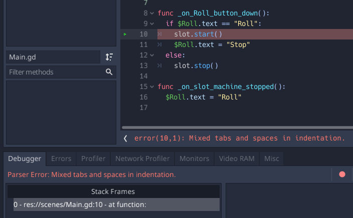

## Overview

> Godot and React JS are great at doing their own things. Together, can they deliver the Killer Casino App? 

### Godot Crash Course

[React Web App](https://discover-godot.web.app)
[Pingpong](https://discover-godot.web.app/games/Pingpong)
[SlotMachine](https://discover-godot.web.app/games/SlotMachine)
[Proxy API](https://discover-godot.web.app/api/)

## Objectives

1. Clone repo https://github.com/CadanoX/Godot-Slot-Machine && Get it to compile

2. Export the project to run on a browser, host it on a local web server (nginx/apache/your favourite web server) and load the game in a browser

3. Add an FPS counter that is visible on a mobile resolution. You can use Chrome's developer tool to bring up a browser window with an iPhone resolution. Create a screen capture of the game running under mobile resolution with the FPS counter visible

4. Add a loading screen to the game: the loading screen just needs to be a button that when clicked loads the main game. Zip the project

5. Clicking the "ROLL" button makes an HTTP request (it doesn't matter to what URL - it's just for testing) - take a screenshot of the packet containing the HTTP request

## Conclusions

> *SlotMachine Blocker*. Given a little more experience with Godot, I'm sure that this error will be trivial to deal with but as a newbie it's blocking me running the game. I have had it working at one point, but I can't remember what I did :)



- Games to be deployed as webapps. This means a single directory containing only static assets, usually with an `index.html` at the root level which (hopefully) references it's dependent files properly so that it deploys and runs any where on any server, from apache to the most sophisticated cloud architecture. Godot export presets are found here `./games/HelloWorld/export_presets.cfg`

### Install

You'll need node but only to manage the development environment

```bash
cd <working-dir>
git clone https://github.com/listingslab-software/discover-godot
cd ./discover-godot && npm install
cd ./apps/react-app && npm install
cd ../apps/node-app && npm 
cd ../ && npm run
```

### Scripts

- `npm run` Lists available scripts
- `npm start` Starts react-app dev server and opens the app  
- `npm test` Runs jest test suite on react-app
- `npm run dist` Creates webpacked dist folder for deployment

### Project

The project is split into 3 JavaScript apps; Slot Games (Godot), Frontend (React), Backend (Node) 

1. [Slot Games](./apps/docs/slot-games.md) 

Games are developed in Godot; a Free and open source 2D and 3D game engine. React is quite good too. Together can they deliver a Killer Casino App? 

- [Pingpong](./games/Pingpong)
- [SlotMachine](./games/SlotMachine)

2. [React](./apps/react-app) 
3. [Node](./apps/node-app)

#### Docs

- [Godot](./apps/docs/godot.md) 
- [Devops](./apps/docs/devops.md)
- [Create React App](./apps/docs/create-react-app.md)

_vs 1.1.2_
